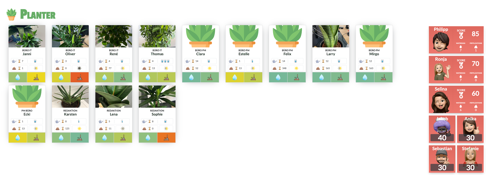

# Planter

The **Planter** is a plant management tool for offices or communities. If you have problems keeping you plants healthy it may be the result of wrong care. If you never know when it would be the best time to water or fertilize your plants you may like **Planter**. After the first setup of your plants with water and fertilize intervals, water amount, ... you will have them on the mobile friendly ui.
Now you can have a look at the **Planter** website to check if your plants would need water or fertilization. The color of the buttons for every plant will fade from green to yellow to indicate that the time for support is there. If you miss out to water your plant longer then the interval the color of the button will slightly turn red to notifiy you kindly to do something. 😁

 


## 🚀 Quick start

#### Requirements

To run the Planter you need the following things installed on your system:
  - Docker

    
#### Install & Run

##### Checkout

Check out the code of this repository (master branch is recommended) and navigate into this folder.
You should check the `.env.example` file to adjust some of the options like ports and features before running. 

If you don't want to adjust anything just copy the `.env.example` file and rename it to `.env`. You will need this file to run the Planter.

##### Setup

Execute setup script for initial database inserts.

```shell

# If you have npm installed
npm run setup
# Or if you want to use the old fashioned way
./admin/scripts/setup.sh
```

##### Startup

If you are ready to go then execute the startup command. Please be sure to setup the database before!

**Easy Mode**
If you have npm or yarn installed you can use the prepared commands to start the application.
```shell
npm run start
```

To stop **Planter** 
```shell
npm run stop
```

**Advanced (Control) Mode**

```shell
docker compose up -d
```
If you did so the Planter will be available after some time (Admin: 5-10s | UI: 30s ). This is due to startup setup and build mechanism. 

To stop the application
```shell
docker compose down
```

##### Controlpanel and UI

Navigate your browser to the following urls to access the Planter Admin and UI:

UI:    http://127.0.0.1:61000
Admin: http://127.0.0.1:61001

You can now use an nginx or other webserver to control the delivery of Planter. You could also setup a local DNS for your LAN to use a domain on your intranet.

#### Backup & Restore
If you want to backup your database simply use the prepared npm scripts to do so or use the shell commands. 
Be aware that the backup process and also the restore process will shutdown the docker containers to get access to the volume and do the backup properly. Also it is **important** to remember that the restore process will **DROP** the database before restoring. Keep that in mind before doing something you will regret.

##### Backup 

```shell
# NPM Script
npm run backup
# Or Shell Script
./admin/scripts/backup.sh
```
##### Restore 

```shell
# NPM Script
npm run restore
# Or Shell Script
./admin/scripts/restore.sh
```

#### Administration

The admin is powered by a headless cms called directus which can do some awesome things for you. But first of all you have to setup your plants. Navigate to http://127.0.0.1:61001/admin/content/plant to create your first plant.

 

Give it a name, setup a photo 📸 for the plant. We recommend a resolution of 300x500 for best 🏎 performance. 
> Notes are for internal usage only. You can write special treatments there. They won't show in the UI.

Plant Usage is very important. It declares the type of the plant. If you wish you can take on of the pre setup plant types. You can also create a complete new plant usage type. They contain the water and fertilize intervals, the amount of water to use and how much sun the plant should get. 

> Find information about plants on the internet (e.g. https://www.picturethisai.com). 


Last fill out the last times the plant were watered and fertilized. If you are unsure you are clearly not watered or fertilized the plant the last 2 days. 😉

**You are now ready to check your plants in the ui.**

 

You can now see what your plants need. In the next chapter you learn about the UI of each plant and what the icons want to tell you. 

##### Interface Description

In your plant card you can see the image of the plant, the location information and the name of it. If you setup no image a placeholder will be used.
The 2 icon rows describe the health status. The first row is all about watering 💧. With the ⏳ hourglass it describes how many **days** are left until the water interval is reached after the last watering. 

The waterglas describes how many 250 ml water glasses you should use to water this plant. 
> We decided to use water glasses as a amount of water for a plant. Due to the fact that most of the normal sized water glasses have 200 to 250ml of water, you can't do that much of a damage with too much or too less water. The icon can also show `50%` or `75%` values. Which is visible at "Puffy". 

The second row is split up to two parts. First is the fertilization. It has the same icon language and means how many days are left until you need to fertilize the plant. 
The last part of the second row is about the placement of the plant. Full sun, shadow? 
> This information is out of *`plant_usage`* which is your term to fill or adjust according to you research!

**Colored Buttons**
The two buttons in the last row are showing the current state of the plant. The left one with the drop icon is the status of the watering. While the water inverval moved down to zero the color of this button will change from green to yellow. If the water interval is 1.5 times overdue the button changes it's color from yellow to red to indicate the near death. 😂

You can then click on the buttons to indicate that you have watered or fertilized. Then their status will be reset to the time you clicked the button. 

**Gamification**

 

Want to have more colleagues to join your watering game? Why not use gamification for this? 
Planter also has the option to use scores for watering or fertilizationing. If you set the environment variable `GATSBY_PLANTER_SHOW_USERS` to `true` you get the scoreboard in the ui. 

> Note that the scoreboard is only shown on devices with more then 1920px (Full HD). This is because we have offices in mind. You may display **Planter** on a TV screen and use a tablet to control the watering. The scoreboard won't show on tablet, while being visible on the screen. 

Every watering scores with 10 and fertilization with 15 points. 
To ensure there is no cheating 👿 you can't water or fertilize again until 1/4 of the interval has passed. 


#### Configuration

| **Option**                | **Type** | **Default**                      | **Description**                                                                                                                          |
|---------------------------|----------|----------------------------------|------------------------------------------------------------------------------------------------------------------------------------------|
| NODE_ENV                  | string   | `development`                      | Is used to create a production build. In most cases development is totally fine.                                                         |
| DIRECTUS_HOST             | string   | `http://directus:${DIRECTUS_PORT} `| You dont need to change this. If there is trouble with the port, you can use DIRCECTUS_PORT to change it and the host will change anyway |
| DIRECTUS_PORT             | number   | 61001                            | The port where you can reach out to the admin panel                                                                                      |
| DIRECTUS_ADMIN_EMAIL      | string   | admin@admin.com                  | The default user to get access to the admin panel                                                                                        |
| DIRECTUS_ADMIN_PASSWORD   | string   | planter_admin                    | The default passwort for the admin user. Should have a length of least 8 characters                                                     |
| WEBSOCKET_PORT            | number   | 60000                            | Websocket connection for updates to the ui                                                                                               |
| WEBHOOK_PORT              | number   | 60001                            | Webhook Port for directus to call the websocket server for updates                                                                       |
| GATSBY_PORT               | string   | 61000                            | The port which is used to access the UI                                                                                                  |
| GATSBY_PLANTER_SHOW_USERS | boolean  | `true`                             | Do you want to use gamification and users? If not set it to false                                                                        |


### Support

If you need any further support feel free to open an issue. 
